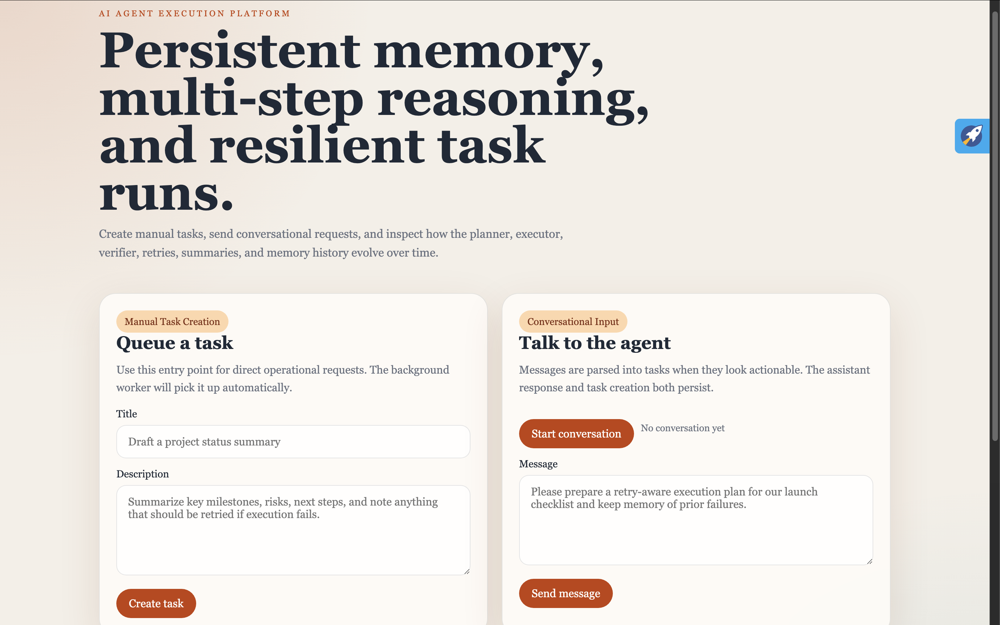

# AI Agent Memory & Task Execution Platform

An AI-powered task execution system with persistent memory, multi-step reasoning, failure recovery, execution history, and duplicate prevention.

## Chosen Input Features

- Manual task creation
- Conversational input

## Stack

- Python 3.12
- FastAPI
- Async SQLAlchemy
- SQLite
- Gemini API through the OpenAI-compatible endpoint
- Docker

## What It Does

The platform simulates a real operational AI agent that:

- persists memory across runs
- retrieves relevant prior context
- summarizes long histories
- runs a multi-step workflow
- retries failed executions
- preserves recovery context
- avoids duplicate execution
- exposes execution traces and summaries

## Multi-Step Workflow

Each task goes through:

1. `memory_loader`
2. `planner`
3. `executor`
4. `verifier`

Each stage stores its own input, output, status, and concise reasoning trace.

## Persistent Memory Model

The system stores:

- request memory
- plan memory
- result memory
- summary memory
- failure memory

It retrieves the most relevant entries for future executions and compresses long histories when needed.

## ScreenShots
1. Create a manual task.
  
2. List tasks.

3. Send a conversational task message.
   
4. List Conversations

## API Endpoints

### Health

- `GET /health`

### Manual Tasks

- `POST /tasks`
- `GET /tasks`
- `GET /tasks/{task_id}`
- `POST /tasks/{task_id}/retry`

### Conversations

- `POST /conversations`
- `GET /conversations/{conversation_id}`
- `POST /conversations/{conversation_id}/messages`

## Local Run

### 1. Create environment file

```bash
cp .env.example .env
```

Set `GEMINI_API_KEY` in `.env`.

### 2. Install dependencies

```bash
python -m venv .venv
source .venv/bin/activate
pip install -r requirements.txt
```

### 3. Start the server

```bash
uvicorn app.main:app --reload
```

Open `http://localhost:8000`.

## Environment Notes

- `DATABASE_URL=sqlite+aiosqlite:///./agent.db` stores the local SQLite database as `agent.db` in the project root
- `GEMINI_API_KEY` is the key used by the OpenAI-compatible Gemini endpoint
- `LLM_BASE_URL` defaults to `https://generativelanguage.googleapis.com/v1beta/openai/`
- `LLM_MODEL` defaults to `gemini-2.5-flash-lite`

## Docker Run

### 1. Prepare environment

```bash
cp .env.example .env
```

### 2. Start with Docker Compose

```bash
docker compose up --build
```

Open `http://localhost:8000`.

## Example Manual Task

```bash
curl -X POST http://localhost:8000/tasks \
  -H "Content-Type: application/json" \
  -d '{
    "title": "Create a recovery-aware launch checklist",
    "description": "Prepare a launch checklist, mention likely failure points, and summarize how the agent should recover if execution is interrupted.",
    "max_retries": 2
  }'
```

## Example Conversation Flow

```bash
curl -X POST http://localhost:8000/conversations \
  -H "Content-Type: application/json" \
  -d '{"title":"Demo Conversation"}'
```

Then send:

```bash
curl -X POST http://localhost:8000/conversations/{conversation_id}/messages \
  -H "Content-Type: application/json" \
  -d '{
    "content": "Please create a task that reviews yesterday'\''s failed rollout notes, avoids repeating the same actions, and gives me a concise execution summary."
  }'
```

## Execution States

- `queued`
- `running`
- `retrying`
- `completed`
- `failed`
- `deduplicated`

## How Reliability Works

### Duplicate Prevention

- every task gets a fingerprint from normalized task text
- prior completed runs with the same fingerprint are reused
- duplicate tasks are marked `deduplicated`

### Failure Recovery

- failure reason is stored
- recovery context is persisted
- retry scheduling is tracked in the database
- prior failure details are fed back into the next execution attempt

### History and Explainability

- `tasks` record overall state
- `task_steps` record each workflow stage
- `execution_events` record the execution timeline
- `memory_entries` preserve durable agent memory

## Submission Checklist

- GitHub repository: this repo
- README: included
- Architecture explanation: `ARCHITECTURE.md`
- `.env.example`: included

## Project Structure

```text
.
├── app
│   ├── agent.py
│   ├── config.py
│   ├── database.py
│   ├── llm.py
│   ├── main.py
│   ├── memory.py
│   ├── models.py
│   ├── schemas.py
│   ├── static
│   │   └── index.html
│   └── worker.py
├── .env.example
├── ARCHITECTURE.md
├── docker-compose.yml
├── Dockerfile
├── README.md
└── requirements.txt
```
